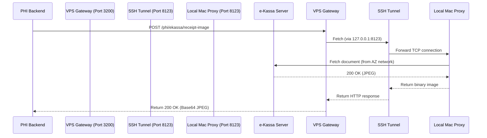

# e-Kassa Outbound Tunnel Setup

The Azerbaijani tax office server (`monitoring.e-kassa.gov.az`) geo-blocks all non-Azerbaijani IP addresses (including VPS/cloud ranges). To fetch receipt images, the gateway must route its calls through a proxy located in Azerbaijan.

Since your local macOS machine is connected in Azerbaijan and has access, we set up a secure **Reverse SSH Tunnel** that forwards the VPS's outbound e-Kassa requests back to a lightweight HTTP/HTTPS proxy running locally on your Mac.

---

## Architecture Overview



---

## How to Restart the Tunnel (If Local Mac or SSH Closes)

If the local proxy server or the SSH connection is interrupted, e-Kassa requests will fail with `504 Gateway Timeout` or `502 Bad Gateway`. Follow these steps to restore the tunnel:

### Step 1: Start the Local Proxy on macOS
Open your local terminal and start the zero-dependency HTTP proxy:
```bash
node /Users/faignaghiyev/DEV/PHI-backend-vps/scratch/local-proxy.js
```
*(Runs in the foreground. Keep this terminal window open or run in background).*

### Step 2: Establish the Reverse SSH Tunnel
In a new terminal window, connect to the VPS with remote port forwarding:
```bash
ssh -N -R 8123:127.0.0.1:8123 admin@188.245.144.148
```
* `-N`: Do not execute a remote command (just forward ports).
* `-R 8123:127.0.0.1:8123`: Forwards port `8123` on the VPS to `127.0.0.1:8123` on your Mac.

---

## VPS Configuration Reference
The VPS environment file `/opt/phi-gateway/config/phi-gateway.env` is configured with:
```env
EKASSA_PROXY=http://127.0.0.1:8123
```
If the tunnel port is changed, update this variable in `/opt/phi-gateway/config/phi-gateway.env` and run `sudo systemctl restart phi-gateway.service`.
